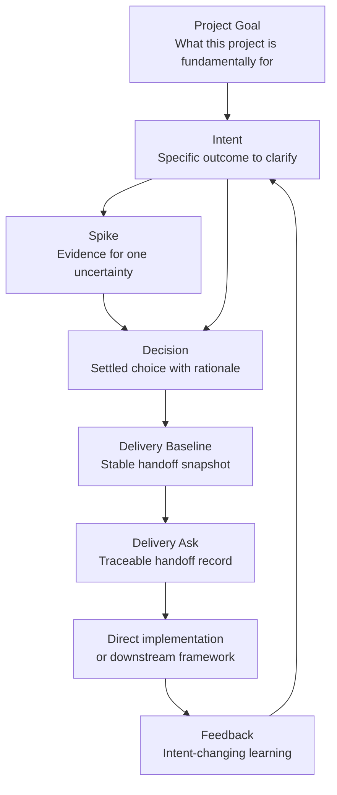
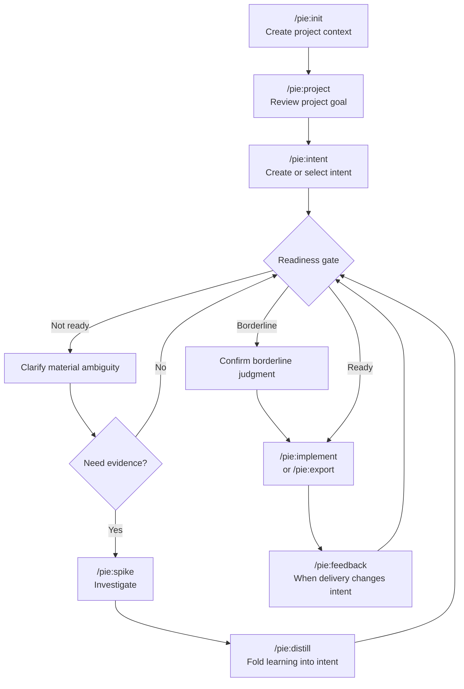

# Progressive Intent Engineering

Coding agents work well when the intent is clear. Real projects often begin before that point.

A user may know the pain, but not the exact behavior, scope, constraints, architecture, data model, success criteria, or trade-offs. If an agent starts coding too early, it may build something plausible but wrong. If it asks questions, the answers often stay trapped in chat. If implementation discovers a new constraint, the original intent may never be updated.

Progressive Intent Engineering (PIE) is a lightweight workflow for turning unclear software intent into delivery-ready intent.

PIE helps an agent answer:

```text
Is this ready to deliver?
If yes, what stable baseline should delivery use?
If no, what question, decision, evidence, or feedback is missing?
```

PIE sits upstream of implementation and delivery frameworks. It does not replace specs, plans, tests, [Spec Kit](https://github.com/github/spec-kit), [LID](https://github.com/jszmajda/lid), or your team's delivery process. It gives them better input.

## When To Use PIE

Use PIE when:

- the user knows the goal, but the behavior or scope is still fuzzy;
- a decision needs evidence from a spike, prototype, benchmark, code inspection, or domain check;
- a brownfield change may alter what the existing system is for;
- multiple intents are moving in parallel and need durable status;
- implementation or downstream planning may reveal feedback that should update the original intent.

For a tiny, obvious code change, PIE should stay out of the way.

## The Core Idea

PIE keeps one project-level goal, then matures individual intents under that goal until they pass a readiness gate.



The important distinction is simple:

- **Project Goal**: what the project is fundamentally trying to accomplish.
- **Intent**: one specific outcome to clarify and eventually deliver.
- **Spike**: focused evidence gathering for one uncertainty.
- **Decision**: a settled choice with rationale and impact.
- **Delivery Baseline**: the delivery-ready snapshot of the intent.
- **Delivery Ask**: the traceable handoff to direct implementation, [Spec Kit](https://github.com/github/spec-kit), [LID](https://github.com/jszmajda/lid), or another delivery path.
- **Feedback**: delivery-stage learning that changes the intent.

PIE does not create recursive intent trees or downstream task breakdowns. Large delivery decomposition belongs to delivery frameworks or implementation planning.

## Typical Workflow



PIE is not ceremony. A material ambiguity is one where different answers would produce a meaningfully different Delivery Baseline. Explicit clarification answers should update the intent immediately. Inferred or project-shifting decisions should be confirmed before they are recorded as accepted. `/pie:distill` is for broader synthesis: spike findings, long discussions, accumulated evidence, or an explicit checkpoint.

## What PIE Writes

PIE keeps durable state in files, not chat memory:

```text
docs/pie/
  project.md
  index.md
  <intent>/
    intent.md
    baseline.md
    baselines/
      <baseline_id>.md
    asks/
      <ask_id>.md
    exports/
    spikes/
      <spike>/
        spike.md
spikes/
  <spike>/
```

Spike-only code belongs under top-level `spikes/<spike>/`, not under `docs/`. PIE initialization should exclude `spikes/` from Git, and should exclude both `spikes/` and `docs/pie/` from lint, test, build, and package-publish inputs when those tools are present. `docs/pie/` is durable state and should normally stay versioned.

The artifact files under `docs/pie/` are authoritative. `docs/pie/index.md` is a derived registry that can be regenerated from those artifacts. Active intent and active spike are session-local selections, not shared durable project state.

## Quick Start: Claude Code

Install PIE from `github.com/qiangxue/pie`:

```text
/plugin marketplace add qiangxue/pie
/plugin install pie@pie
```

Initialize PIE in a repository:

```text
/pie:init
```

For a greenfield project, PIE asks for the Project Goal. For a brownfield project, PIE reconstructs a candidate goal and guardrails from repo context and asks you to confirm or revise them.

Create an intent:

```text
/pie:intent stock-screener "Build a local stock screener that finds high-quality breakout candidates."
```

Common commands:

```text
/pie:project
/pie:intent
/pie:spike vcp-scoring
/pie:distill
/pie:implement
/pie:export speckit
/pie:export lid
/pie:feedback "Spec Kit planning exposed a new evaluation ambiguity."
```

Optional commands:

```text
/pie:baseline
/pie:decision "Defer intraday signals until after the first production version."
```

For command details, see [docs/claude-code-command-reference.md](docs/claude-code-command-reference.md).

## Quick Start: Codex

Copy or adapt the Codex [AGENTS.md template](plugins/templates/codex/AGENTS.md) into your project root. If the project already has an `AGENTS.md`, merge the PIE sections instead of replacing existing rules.

Then use concise prompt commands:

```text
PIE init
PIE project
PIE intent stock-screener: Build a local stock screener that finds high-quality breakout candidates.
PIE spike vcp-scoring: compare binary VCP detection with ranked setup scoring.
PIE distill
PIE implement
```

Codex can also export downstream seeds:

```text
PIE export speckit
PIE export lid
```

For details, see [docs/codex-guide.md](docs/codex-guide.md).

## Delivery Frameworks

PIE can hand delivery-ready intent to downstream delivery frameworks through adapters:

- [`speckit`](https://github.com/github/spec-kit): `/pie:export speckit` writes `docs/pie/<intent>/exports/speckit-seed.md`.
- [`lid`](https://github.com/jszmajda/lid): `/pie:export lid` writes `docs/pie/<intent>/exports/lid-seed.md`.

Each export creates a delivery ask record and adds a `PIE Origin` block to the seed, so later feedback can point back to the exact intent and baseline revision that produced the downstream ask.

## Examples

Start here if you want to see PIE in context:

- [Greenfield example](docs/greenfield-example.md): shape a new stock screener before implementation.
- [Brownfield example](docs/brownfield-example.md): assess and prepare an existing system before adding behavior.

## Reference

- [Framework specification](docs/framework-specification.md)
- [Claude Code command reference](docs/claude-code-command-reference.md)
- [Codex usage guide](docs/codex-guide.md)
- [Claude Code plugin](plugins/claude-code/pie)
- [Contributing](CONTRIBUTING.md)

## Repository Map

```text
docs/
  framework-specification.md
  claude-code-command-reference.md
  codex-guide.md
  greenfield-example.md
  brownfield-example.md
plugins/claude-code/pie/
  commands/
  adapters/
  skills/
plugins/templates/
  claude-code/
  codex/
```

## License

MIT. See [LICENSE](LICENSE).
